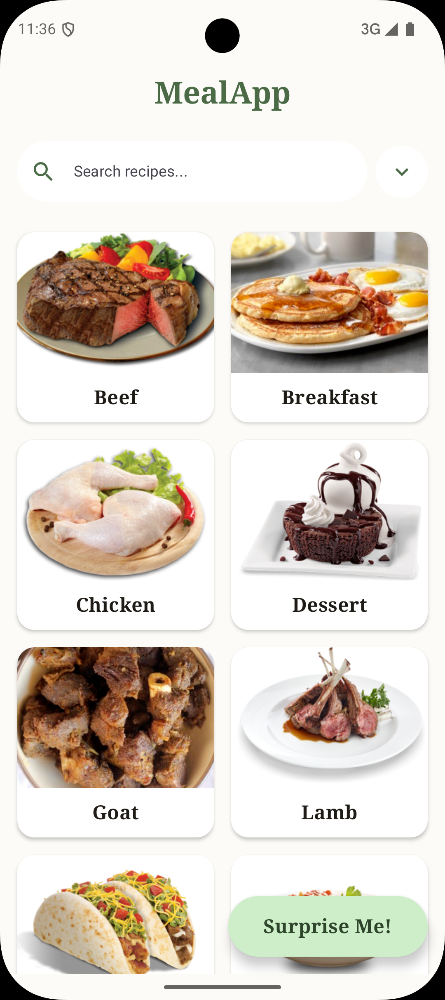
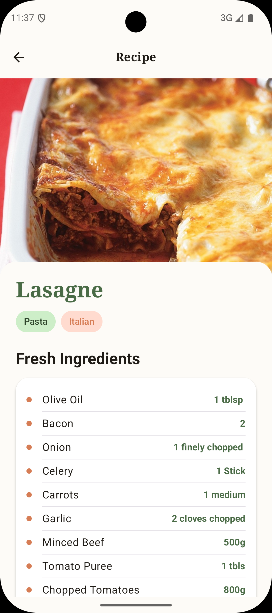

# FIL-A2-KOTLIN-MEALAPP

Technical demonstration of modern Android development using Clean Architecture, MVI, and Jetpack
Compose to fetch and display categories and meals via REST API, ensuring a scalable, unidirectional
data flow.

### 🏗 Technical Architecture

* **Pattern:** MVI (Model-View-Intent) for predictable state management and UI consistency.
* **Layers:** Strict separation into Data (DTOs, Retrofit), Domain (Models, Repository Interfaces),
  and Presentation (ViewModels, Compose).
* **State Management:** Utilizes `StateFlow` and `Result` wrappers to emit `Loading`, `Success`, and
  `Failure` states via cold `Flow` builders.

### 💻 Tech Stack

* **UI:** 100% **Jetpack Compose** with Material 3.
* **Networking:** **Retrofit 2** for RESTful communication with TheMealDB API.
* **Concurrency:** Kotlin **Coroutines** and **Flow** for non-blocking asynchronous operations.
* **Image/Video:** **Coil** for async image rendering and **Android-YouTube-Player** for
  WebView-based video integration.

| Categories Screen                                       | Meals Screen                                  | Details Screen                                    |
|---------------------------------------------------------|-----------------------------------------------|---------------------------------------------------|
|  |  |  |